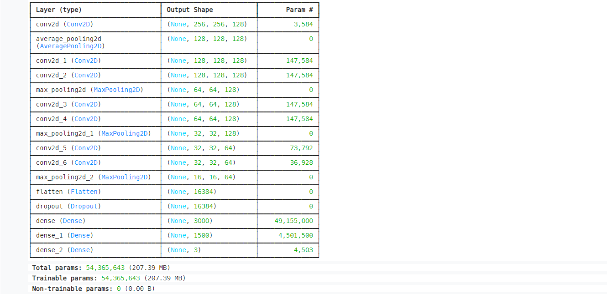

# Akciğer Kanseri Dataset Modeli

Kaggle dataseti görüntülemek [için](https://www.kaggle.com/datasets/akifcetin/lung-cancer-dataset-train-model/) ziyaret edebilirsiniz.

Bu proje, Kaggle'dan elde edilen akciğer kanseri veri kümesi üzerinde scikit-learn ve Keras kütüphaneleri kullanılarak bir sınıflandırma modeli oluşturmayı amaçlamaktadır.

## Veri Kümesi
Kullanılan veri kümesi, X-ray görüntüleri üzerinde etiketlenmiş normal, benign ve malign vakalardan oluşmaktadır. Veri kümesine [kaynak_linki] adresinden erişilebilir.

## Model
Bu proje iki farklı model kullanılarak gerçekleştirilmiştir: scikit-learn ve Keras.
https://www.kaggle.com/datasets/akifcetin/lung-cancer-dataset-train-model/

## Katkılar
Bu projeye katkıda bulunmak isterseniz, lütfen forklayın ve pull request gönderin.

## Lisans
Bu proje Apache 2.0 Lisansı altında lisanslanmıştır. Daha fazla bilgi için LICENSE dosyasını kontrol edin.

## İletişim
Projeyle ilgili herhangi bir sorunuz veya geri bildiriminiz varsa, lütfen tr.ahmetakifcetin@gmail.com adresine iletin.

## Testler

Testleri çalıştırmak için aşağıdaki komutu çalıştırın

```bash

Scikit-learn Modeli: Lung-Cancer-Dataset
Parametreler:
Parametre 1: 15
Parametre 2: 20
```

## Eğitim
```bash

Eğitim adımları şu şekildedir:

Veri kümesi yüklenir ve ön işleme adımları uygulanır.
Model tanımlanır ve eğitim verisiyle eğitilir.
Modelin performansı değerlendirilir.

```

## Performans
Her iki modelin performansı aşağıdaki metriklerle değerlendirilmiştir:

```bash
Accuracy
Precision
Recall
F1 Score
Sonuçlar
Scikit-learn Modeli:
Accuracy: [accuracy_değeri]
Precision: [precision_değeri]
Recall: [recall_değeri]
F1 Score: [f1_score_değeri]
Keras Modeli:
Accuracy: [accuracy_değeri]
Precision: [precision_değeri]
Recall: [recall_değeri]
F1 Score: [f1_score_değeri]
```

## Gereksinimler
Projenin çalıştırılması için aşağıdaki kütüphanelere ihtiyaç vardır:
```python
import numpy as np
import pandas as pd
import matplotlib.pyplot as plt
import cv2
import PIL as pl
import random
from sklearn.model_selection import train_test_split
import tensorflow as tf
from tensorflow.keras.utils import image_dataset_from_directory, img_to_array
from tensorflow.keras.models import Sequential
from tensorflow.keras.layers import Conv2D, AvgPool2D, MaxPooling2D, Flatten, Dense, Dropout

import os
for dirname, _, filenames in os.walk('/kaggle/input'):
    for filename in filenames:
        print(os.path.join(dirname, filename))

import warnings
warnings.filterwarnings('ignore')
```
## Kullanım
Projenin kullanımı adımları:

- Kodları klonlayın.
- Gerekli kütüphaneleri yükleyin.
- Veri kümesini indirin ve uygun bir dizine yerleştirin.
- Eğitim ve test veri setlerini belirleyin.
- Modelinizi eğitin ve performansını değerlendirin.
## Ekran Görüntüleri


  